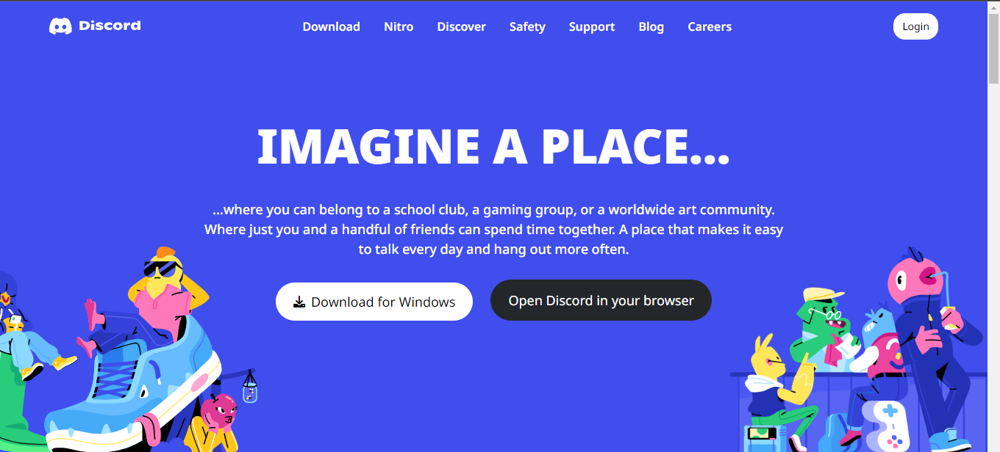

## ⭐Responsive Discord Clone Using Tailwind CSS⭐

## This website is for educational purpose only

 

## 📌 Live Site URL: <a href="https://discord-clone-tailwindcss.netlify.app/">**Visit Now**</a>

 

## 📌 Screenshot:

 

## 📌 Features:

- ### The website is responsive in all screen devices
- ### Used flexbox to make website responsive
- ### Used Mobile-first approach to make this website

 

## 📌 Time Taken To Complete This Project:

- ### It took me 2 Days to make this project

 

## 📌 Installation:

- ### To run this website locally in your system just clone this repo and then open it with live server. If it asks for folder selection choose `src` folder.

 

## 📌 Social Links:

